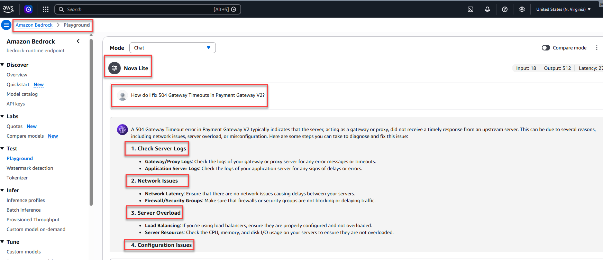
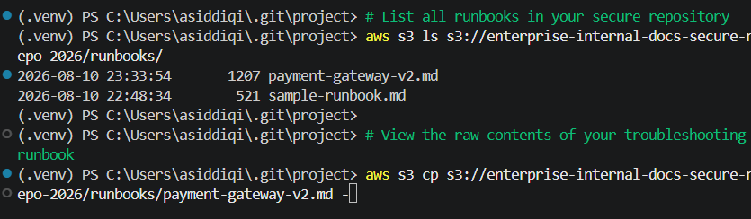

# Enterprise RAG & MCP Pipeline

A secure, production-ready Retrieval-Augmented Generation (RAG) and Model Context Protocol (MCP) pipeline designed for automated technical troubleshooting. This project integrates **Amazon Bedrock (Nova Lite)** for scalable AI reasoning, **FastMCP** for secure tool orchestration, and an **Amazon S3** enterprise repository for ground-truth technical documentation storage.  


## 🏛️ Architecture & Component Flow

```text
[ User / Chat Client (client.py) ] 
       │ (Multi-turn Prompt & History)
       ▼
[ Amazon Bedrock (Nova Lite) ] ──(Tool Request)──► [ FastMCP Server (server.py) ]
       ▲                                                        │
       └───────────────(Retrieved Context / Tool Result)────────┘
                                                                │ (S3 API Call)
                                                                ▼
                                                   [ Secure S3 Bucket Repository ]
```
* **Client (**`client.py`**):** Manages the interactive multi-turn conversation loop, maintains state history, and handles agentic tool-calling payloads required by Amazon Bedrock.

* **Server (**`server.py`**):** A high-performance FastMCP server exposing secure enterprise data tools for retrieving technical runbooks directly from cloud storage.

* **Data Repository (**`AWS S3`**):** Hosts verified markdown troubleshooting runbooks (e.g., payment-gateway-v2.md), ensuring model responses are strictly grounded in authoritative documentation.

* **Intelligence Layer (Amazon Bedrock):** Utilizes the `us.amazon.nova-lite-v1:0` foundation model to parse user queries, invoke tools dynamically, and synthesize accurate technical solutions.


## 📁 Repository Structure

```text
enterprise-rag-mcp-pipeline/
│
├── rag-agent/
│   ├── client.py          # Multi-turn interactive chat agent and Bedrock handler
│   └── enable_model.py    # Automated AWS Bedrock model use case & agreement setup script
├── mcp-server/
│   └── server.py          # FastMCP server handling secure S3 document retrieval
├── infra/                 # Infrastructure as Code configurations
│   ├── main.tf            # Terraform configurations for S3 and IAM roles
│   └── provider.tf        # Terraform provider and backend definitions
├── diagnosis/             # Validation screenshots and execution traces
│   ├── Bedrock.png
│   ├── image_d7f914.png
│   └── image_d7f915.png
├── sample-runbook.md      # Ground-truth documentation sample
└── README.md              # Project documentation and setup guide
```

### ⚙️ Prerequisites
[Python](https://www.python.org/) installed (v3.10+).

[AWS CLI](https://aws.amazon.com/cli/) configured with active credentials and permissions for
AWS CLI configured with active credentials and permissions for:
* `s3:GetObject` / `s3:ListBucket`
* `bedrock:InvokeModel`
* **Amazon Bedrock Access:** Model access enabled for **Amazon Nova Lite** (`us.amazon.nova-lite-v1:0`) in your target region (`us-east-1`).


## 🛠️ Installation & Setup

### 1. Clone & Set Up the Environment

```Bash
git clone https://github.com/Atiq-Siddiqi/enterprise-rag-mcp-pipeline.git
cd enterprise-rag-mcp-pipeline

# Create and activate virtual environment
python -m venv venv
# On Windows (PowerShell):
venv\Scripts\Activate.ps1
# On macOS / Linux:
source venv/bin/activate

# Install dependencies
pip install boto3 fastmcp
```

### 2. Configure AWS Credentials
Ensure your environment can authenticate with AWS:

```Bash
aws configure
```

(Verify your default region matches your Bedrock and S3 resource deployment, e.g., `us-east-1`).

### 3. Running the Pipeline

**1. Start the MCP Server:**
Ensure your FastMCP server is active to handle inbound tool execution requests from the client.

```Bash
python mcp-server/server.py
```

**2. Launch the Interactive Chat Client**:
Open a separate terminal window, activate your virtual environment, and start the agent loop:

```Bash
cd rag-agent
python client.py
```

### 💬 Example Usage Session

```text
=== Enterprise RAG MCP Agent Initialized ===
Type your questions below. Type 'exit' or 'quit' to end the session.

>> How do I fix 504 Gateway Timeouts in Payment Gateway V2?

User: How do I fix 504 Gateway Timeouts in Payment Gateway V2?
[Agent executing MCP tool 'search_internal_docs' with args: {'query': '504 Gateway Timeouts in Payment Gateway V2'}]

Assistant:
Based on the retrieved runbook, a 504 Gateway Timeout in Payment Gateway V2 can be resolved by:
1. **Upstream Acquirer Latency**: Increase API Gateway timeout from 30s to 45s.
2. **Database Connection Pool Exhaustion**: Scale up RDS Aurora or tune connection pool size (minimum: 50, maximum: 200) in `application.yml`.
3. **Lambda Cold Starts**: Enable provisioned concurrency for critical transaction processing functions.
```

## 🔍 Validation & Evidence
The pipeline has been thoroughly tested and validated against real-world troubleshooting scenarios using Amazon Bedrock and the Model Context Protocol.

### 🖥️ Bedrock Playground Execution
Below is the validation screenshot captured from the ***Amazon Bedrock Playground***, demonstrating ***Amazon Nova Lite*** successfully orchestrating tool requests, fetching documentation, and synthesizing actionable technical solutions:


### 📋 Runtime Evidence & Traces
Runtime evidence and tool-invocation validations are below:

* **FastMCP Server Initialization & Handshake:** Captures the initial FastMCP server connection handshake and payload initialization between the client agent and local runtime.


* **S3 Retrieval & Multi-Turn Context Synthesis:** Illustrates successful live S3 document retrieval and multi-turn context synthesis returned during a simulated incident response session.


## 🚀 Key Features & Engineering Highlights
* **Strict Tool-Calling Architecture:** Fully complies with Amazon Bedrock’s `converse` API schema requirements, ensuring seamless payload formatting between user prompts, model tool requests, and tool results.
* **Stateful Multi-Turn Memory:** Preserves message history across interactive sessions for seamless context-aware troubleshooting.
* **Cloud-Native Grounding:** Eliminates hallucinations by fetching live markdown runbooks directly from secure S3 object storage during runtime.


## 🧹 Teardown & Cost Management
To tear down all provisioned AWS resources and ensure no lingering cloud costs are incurred, follow these steps:

🗑️**1. Delete S3 Storage Assets**
Because Amazon S3 prevents the deletion of non-empty buckets, empty and remove your documentation repository bucket using the AWS CLI:

```text
PowerShell
# Recursively remove all runbooks and objects inside the bucket
aws s3 rm s3://enterprise-internal-docs-secure-repo-2026 --recursive

# Delete the empty S3 bucket
aws s3 rb s3://enterprise-internal-docs-secure-repo-2026
```

💰**2. Cost Overview**
* **Amazon Bedrock:** Operates entirely on an on-demand, pay-per-token model (`us.amazon.nova-lite-v1:0`). Because there are no persistent endpoints, dedicated servers, or provisioned throughput instances deployed, **zero ongoing charges** accrue when the pipeline is inactive.
